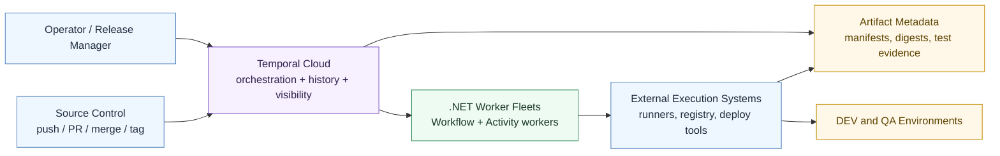
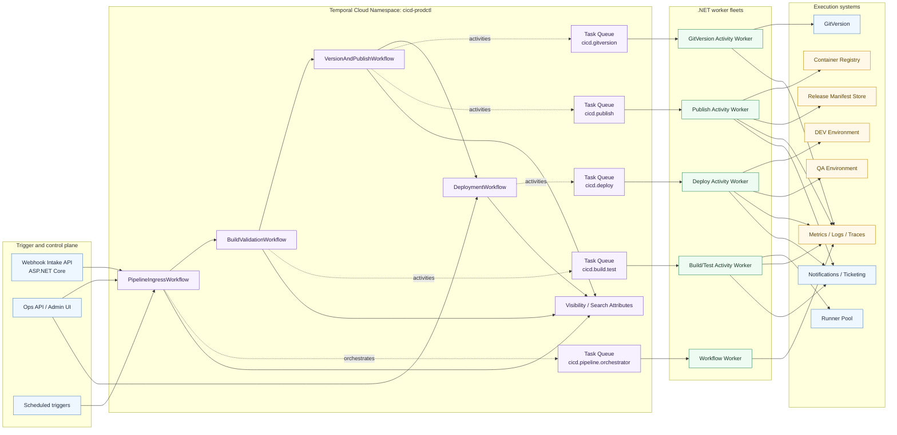
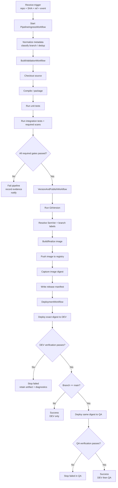
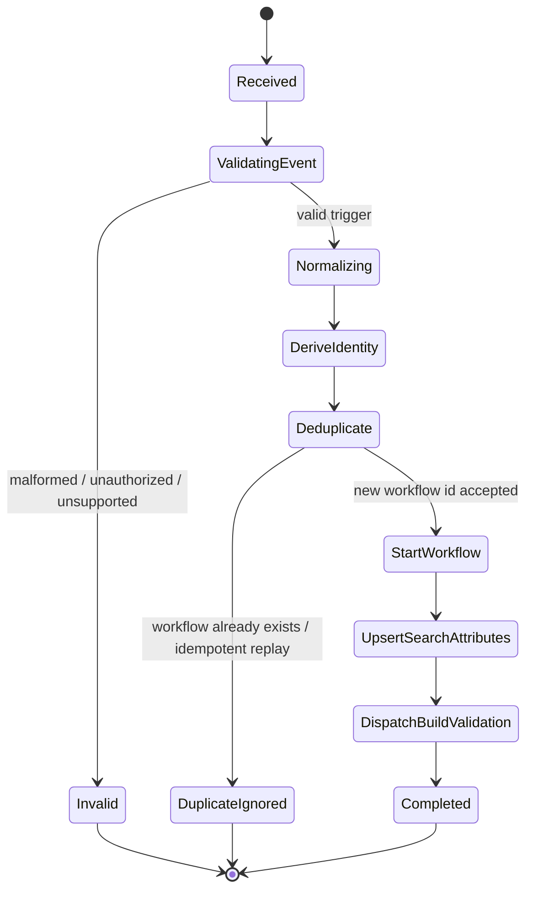
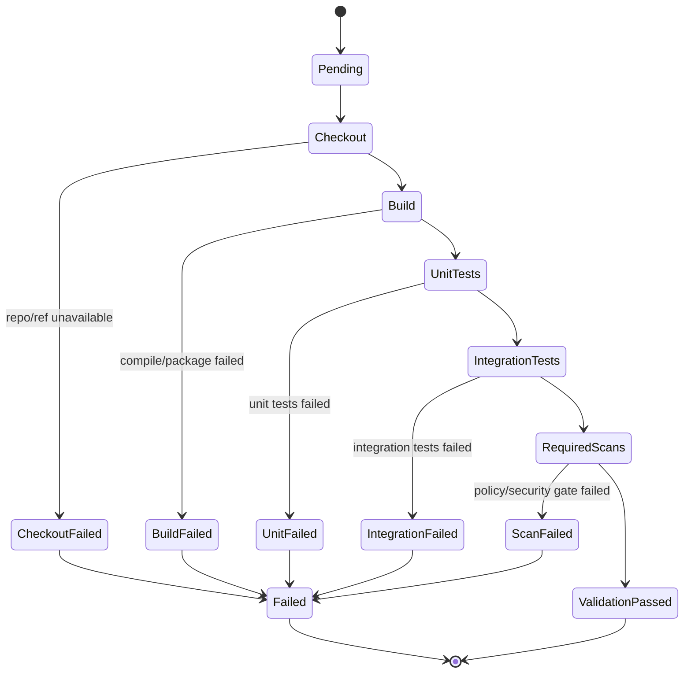
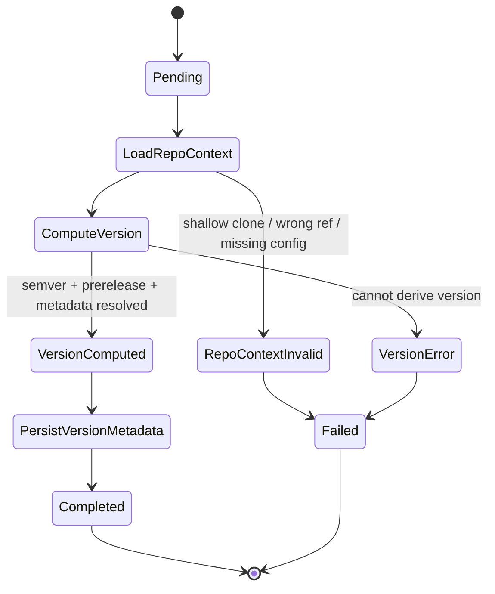
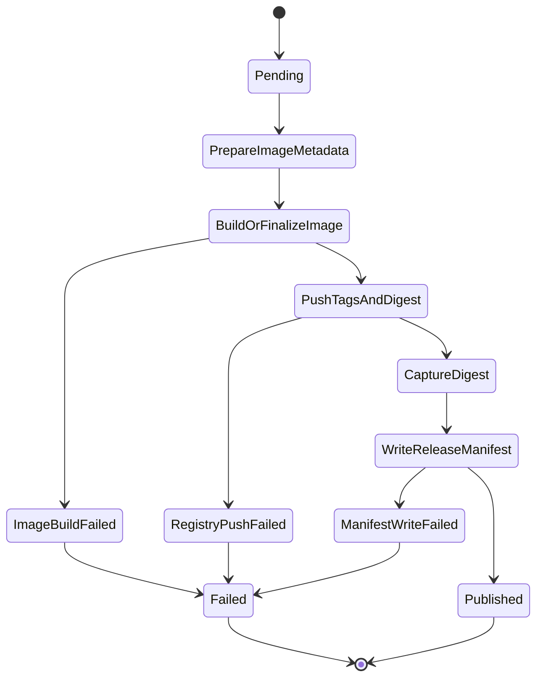
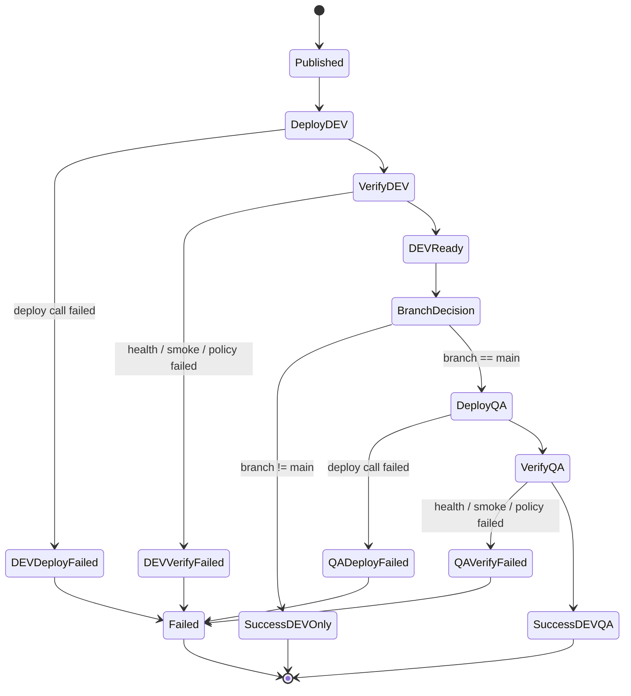
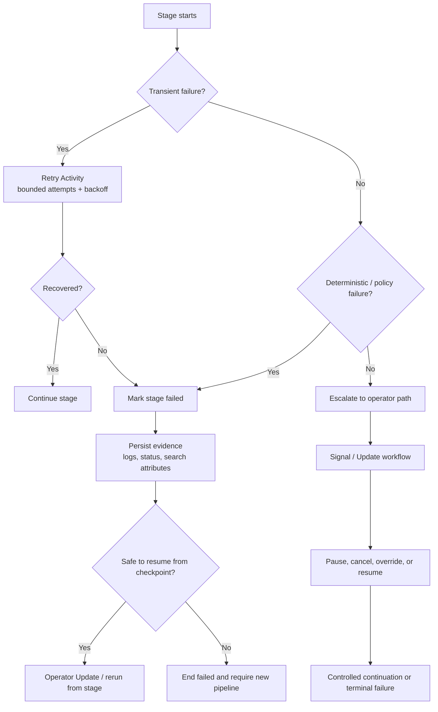
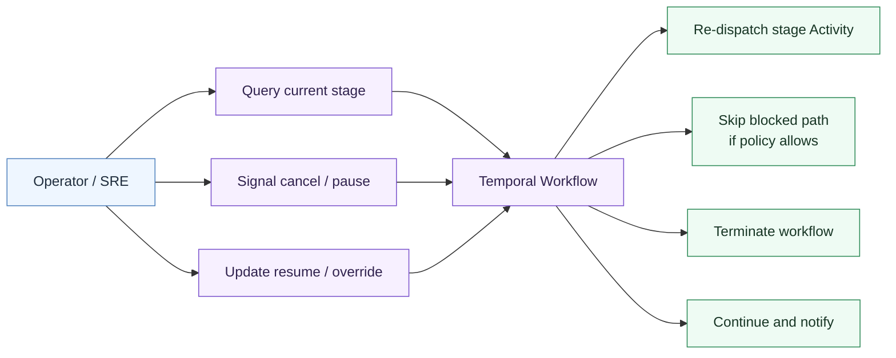

# Temporal Cloud CI/CD — Combined Mermaid Diagram Pack

## 1. System context

## 2. Component architecture

## 3. End-to-end workflow

## 4. Pipeline ingress state machine

## 5. Build validation state machine

## 6. GitVersion state machine

## 7. Publish state machine

## 8. Deployment state machine

## 9. Failure recovery control flow

## 10. Operator controls

