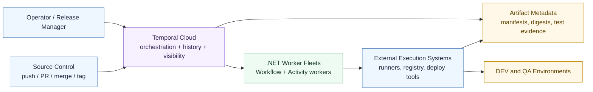

# System Context — Temporal Cloud CI/CD

```mermaid
flowchart LR
    classDef ext fill:#eef6ff,stroke:#4f81bd,color:#1f2d3d,stroke-width:1px;
    classDef temporal fill:#f7f0ff,stroke:#7a52cc,color:#2f214d,stroke-width:1px;
    classDef worker fill:#eefbf3,stroke:#2d8a57,color:#173524,stroke-width:1px;
    classDef data fill:#fff8e8,stroke:#c48a00,color:#5d4300,stroke-width:1px;

    SCM[Source Control\npush / PR / merge / tag]:::ext
    OPS[Operator / Release Manager]:::ext
    TEMP[Temporal Cloud\norchestration + history + visibility]:::temporal
    WORKERS[.NET Worker Fleets\nWorkflow + Activity workers]:::worker
    EXEC[External Execution Systems\nrunners, registry, deploy tools]:::ext
    META[Artifact Metadata\nmanifests, digests, test evidence]:::data
    ENVS[DEV and QA Environments]:::data

    SCM --> TEMP
    OPS --> TEMP
    TEMP --> WORKERS
    WORKERS --> EXEC
    EXEC --> META
    EXEC --> ENVS
    TEMP --> META
```
