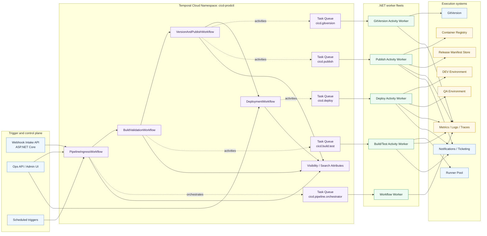

# Component Architecture — Temporal Cloud CI/CD

```mermaid
flowchart LR
    classDef ext fill:#eef6ff,stroke:#4f81bd,color:#1f2d3d,stroke-width:1px;
    classDef temporal fill:#f7f0ff,stroke:#7a52cc,color:#2f214d,stroke-width:1px;
    classDef worker fill:#eefbf3,stroke:#2d8a57,color:#173524,stroke-width:1px;
    classDef data fill:#fff8e8,stroke:#c48a00,color:#5d4300,stroke-width:1px;

    subgraph A[Trigger and control plane]
        WEBHOOK[Webhook Intake API\nASP.NET Core]:::ext
        ADMIN[Ops API / Admin UI]:::ext
        SCHED[Scheduled triggers]:::ext
    end

    subgraph B[Temporal Cloud Namespace: cicd-prodctl]
        WF1[PipelineIngressWorkflow]:::temporal
        WF2[BuildValidationWorkflow]:::temporal
        WF3[VersionAndPublishWorkflow]:::temporal
        WF4[DeploymentWorkflow]:::temporal
        TQ1[Task Queue\ncicd.pipeline.orchestrator]:::temporal
        TQ2[Task Queue\ncicd.build.test]:::temporal
        TQ3[Task Queue\ncicd.gitversion]:::temporal
        TQ4[Task Queue\ncicd.publish]:::temporal
        TQ5[Task Queue\ncicd.deploy]:::temporal
        VIS[Visibility / Search Attributes]:::temporal
    end

    subgraph C[.NET worker fleets]
        W1[Workflow Worker]:::worker
        W2[Build/Test Activity Worker]:::worker
        W3[GitVersion Activity Worker]:::worker
        W4[Publish Activity Worker]:::worker
        W5[Deploy Activity Worker]:::worker
    end

    subgraph D[Execution systems]
        RUN[Runner Pool]:::ext
        GITV[GitVersion]:::ext
        REG[Container Registry]:::data
        MAN[Release Manifest Store]:::data
        DEV[DEV Environment]:::data
        QA[QA Environment]:::data
        OBS[Metrics / Logs / Traces]:::data
        NOTIFY[Notifications / Ticketing]:::ext
    end

    WEBHOOK --> WF1
    ADMIN --> WF1
    ADMIN --> WF4
    SCHED --> WF1

    WF1 --> WF2
    WF2 --> WF3
    WF3 --> WF4

    TQ1 --> W1
    TQ2 --> W2
    TQ3 --> W3
    TQ4 --> W4
    TQ5 --> W5

    WF1 -.orchestrates.-> TQ1
    WF2 -.activities.-> TQ2
    WF3 -.activities.-> TQ3
    WF3 -.activities.-> TQ4
    WF4 -.activities.-> TQ5

    W2 --> RUN
    W3 --> GITV
    W4 --> REG
    W4 --> MAN
    W5 --> DEV
    W5 --> QA

    W1 --> OBS
    W2 --> OBS
    W3 --> OBS
    W4 --> OBS
    W5 --> OBS

    WF1 --> VIS
    WF2 --> VIS
    WF3 --> VIS
    WF4 --> VIS

    W2 --> NOTIFY
    W4 --> NOTIFY
    W5 --> NOTIFY
```
