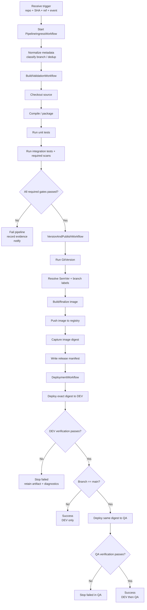

# End-to-End Workflow — Temporal Cloud CI/CD

```mermaid
flowchart TD
    A[Receive trigger\nrepo + SHA + ref + event] --> B[Start PipelineIngressWorkflow]
    B --> C[Normalize metadata\nclassify branch / dedup]
    C --> D[BuildValidationWorkflow]
    D --> D1[Checkout source]
    D1 --> D2[Compile / package]
    D2 --> D3[Run unit tests]
    D3 --> D4[Run integration tests + required scans]
    D4 --> E{All required gates passed?}

    E -- No --> X[Fail pipeline\nrecord evidence\nnotify]
    E -- Yes --> F[VersionAndPublishWorkflow]
    F --> F1[Run GitVersion]
    F1 --> F2[Resolve SemVer + branch labels]
    F2 --> F3[Build/finalize image]
    F3 --> F4[Push image to registry]
    F4 --> F5[Capture image digest]
    F5 --> F6[Write release manifest]

    F6 --> G[DeploymentWorkflow]
    G --> G1[Deploy exact digest to DEV]
    G1 --> H{DEV verification passes?}
    H -- No --> Y[Stop failed\nretain artifact + diagnostics]
    H -- Yes --> I{Branch == main?}
    I -- No --> Z[Success\nDEV only]
    I -- Yes --> J[Deploy same digest to QA]
    J --> K{QA verification passes?}
    K -- No --> Q[Stop failed in QA]
    K -- Yes --> R[Success\nDEV then QA]
```
