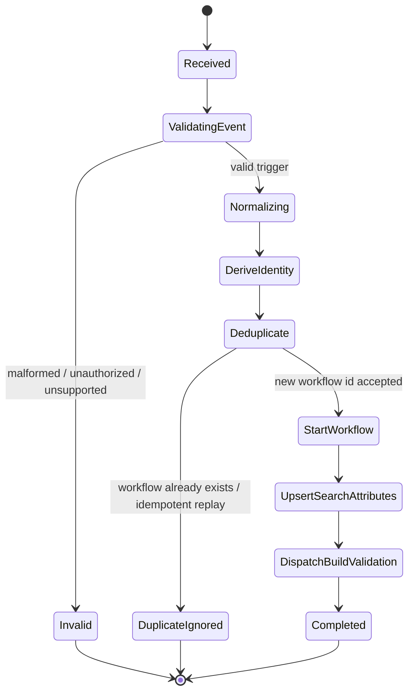

# Pipeline Ingress State Machine

```mermaid
stateDiagram-v2
    [*] --> Received
    Received --> ValidatingEvent
    ValidatingEvent --> Invalid: malformed / unauthorized / unsupported
    ValidatingEvent --> Normalizing: valid trigger

    Normalizing --> DeriveIdentity
    DeriveIdentity --> Deduplicate
    Deduplicate --> DuplicateIgnored: workflow already exists / idempotent replay
    Deduplicate --> StartWorkflow: new workflow id accepted

    StartWorkflow --> UpsertSearchAttributes
    UpsertSearchAttributes --> DispatchBuildValidation
    DispatchBuildValidation --> Completed

    Invalid --> [*]
    DuplicateIgnored --> [*]
    Completed --> [*]
```
