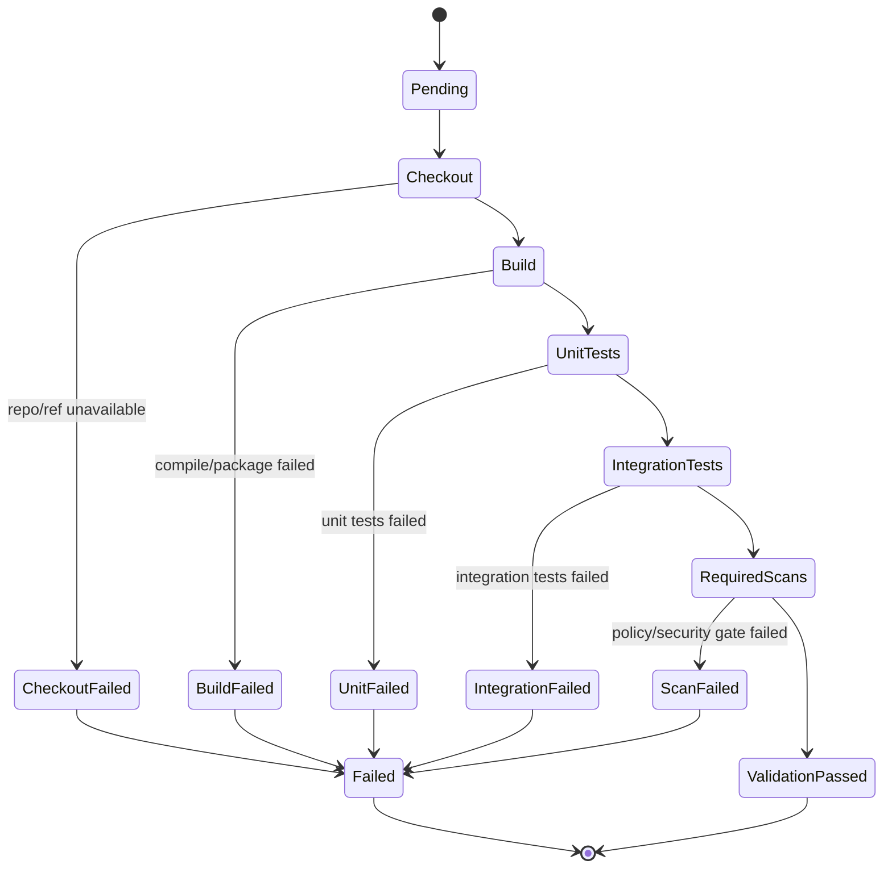

# Build Validation State Machine

```mermaid
stateDiagram-v2
    [*] --> Pending
    Pending --> Checkout
    Checkout --> CheckoutFailed: repo/ref unavailable
    Checkout --> Build

    Build --> BuildFailed: compile/package failed
    Build --> UnitTests

    UnitTests --> UnitFailed: unit tests failed
    UnitTests --> IntegrationTests

    IntegrationTests --> IntegrationFailed: integration tests failed
    IntegrationTests --> RequiredScans

    RequiredScans --> ScanFailed: policy/security gate failed
    RequiredScans --> ValidationPassed

    CheckoutFailed --> Failed
    BuildFailed --> Failed
    UnitFailed --> Failed
    IntegrationFailed --> Failed
    ScanFailed --> Failed

    ValidationPassed --> [*]
    Failed --> [*]
```
