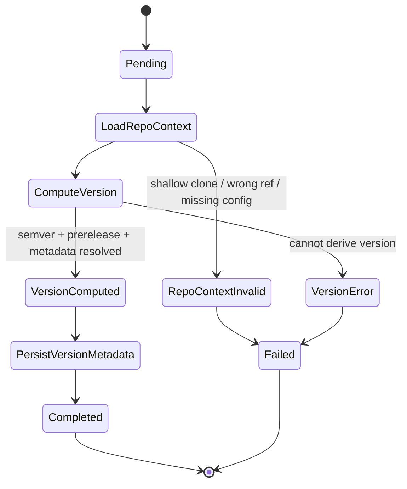

# GitVersion State Machine

```mermaid
stateDiagram-v2
    [*] --> Pending
    Pending --> LoadRepoContext
    LoadRepoContext --> RepoContextInvalid: shallow clone / wrong ref / missing config
    LoadRepoContext --> ComputeVersion

    ComputeVersion --> VersionComputed: semver + prerelease + metadata resolved
    ComputeVersion --> VersionError: cannot derive version

    VersionComputed --> PersistVersionMetadata
    PersistVersionMetadata --> Completed

    RepoContextInvalid --> Failed
    VersionError --> Failed
    Completed --> [*]
    Failed --> [*]
```
