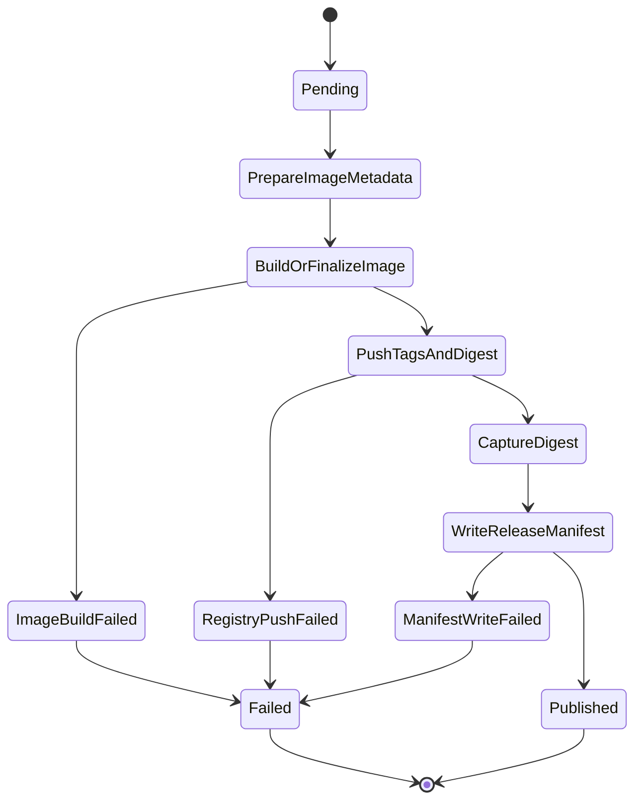

# Publish State Machine

```mermaid
stateDiagram-v2
    [*] --> Pending
    Pending --> PrepareImageMetadata
    PrepareImageMetadata --> BuildOrFinalizeImage
    BuildOrFinalizeImage --> ImageBuildFailed
    BuildOrFinalizeImage --> PushTagsAndDigest

    PushTagsAndDigest --> RegistryPushFailed
    PushTagsAndDigest --> CaptureDigest

    CaptureDigest --> WriteReleaseManifest
    WriteReleaseManifest --> ManifestWriteFailed
    WriteReleaseManifest --> Published

    ImageBuildFailed --> Failed
    RegistryPushFailed --> Failed
    ManifestWriteFailed --> Failed

    Published --> [*]
    Failed --> [*]
```
