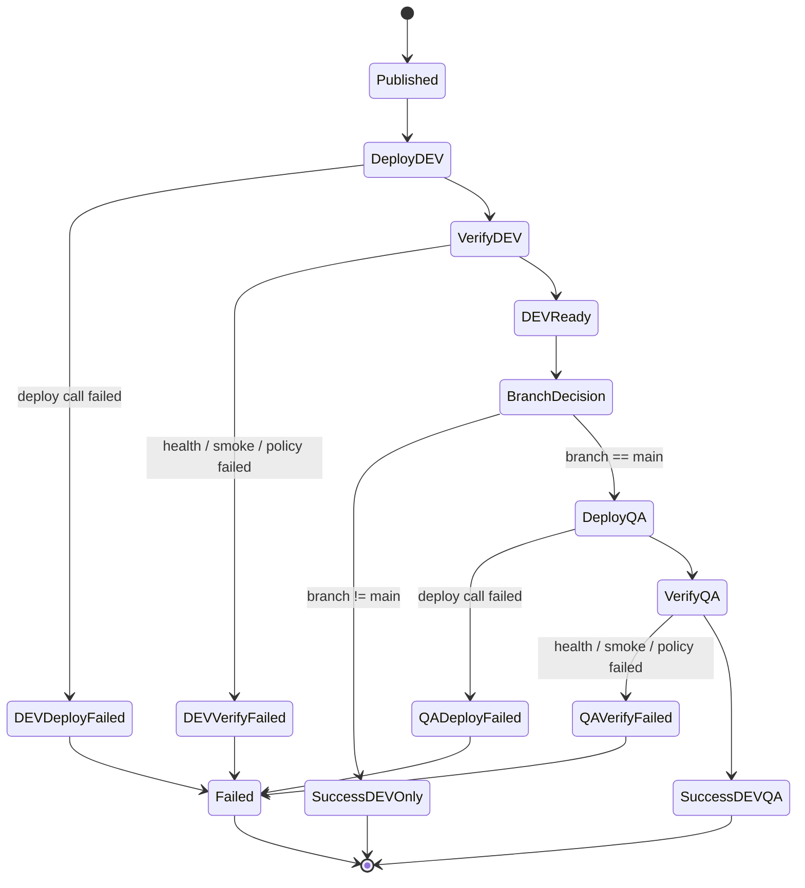

# Deployment State Machine

```mermaid
stateDiagram-v2
    [*] --> Published
    Published --> DeployDEV

    DeployDEV --> DEVDeployFailed: deploy call failed
    DeployDEV --> VerifyDEV

    VerifyDEV --> DEVVerifyFailed: health / smoke / policy failed
    VerifyDEV --> DEVReady

    DEVDeployFailed --> Failed
    DEVVerifyFailed --> Failed

    DEVReady --> BranchDecision
    BranchDecision --> SuccessDEVOnly: branch != main
    BranchDecision --> DeployQA: branch == main

    DeployQA --> QADeployFailed: deploy call failed
    DeployQA --> VerifyQA

    VerifyQA --> QAVerifyFailed: health / smoke / policy failed
    VerifyQA --> SuccessDEVQA

    QADeployFailed --> Failed
    QAVerifyFailed --> Failed

    SuccessDEVOnly --> [*]
    SuccessDEVQA --> [*]
    Failed --> [*]
```
