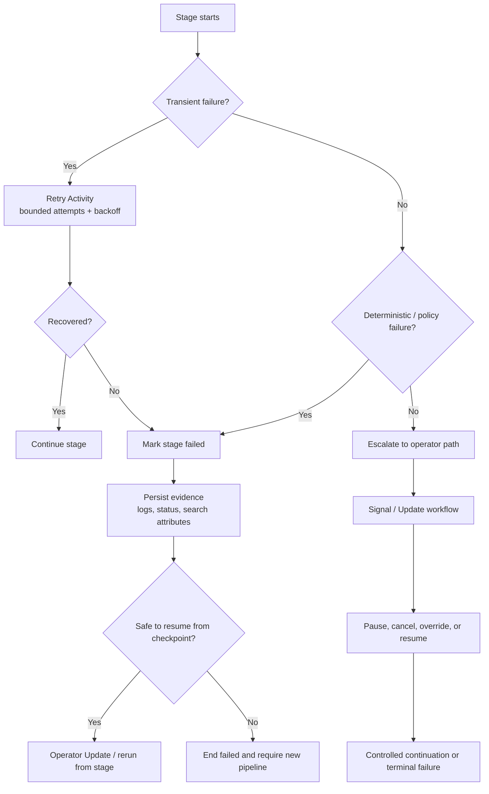

# Failure Recovery Control Flow

```mermaid
flowchart TD
    A[Stage starts] --> B{Transient failure?}
    B -- Yes --> C[Retry Activity\nbounded attempts + backoff]
    C --> D{Recovered?}
    D -- Yes --> E[Continue stage]
    D -- No --> F[Mark stage failed]

    B -- No --> G{Deterministic / policy failure?}
    G -- Yes --> F
    G -- No --> H[Escalate to operator path]

    F --> I[Persist evidence\nlogs, status, search attributes]
    I --> J{Safe to resume from checkpoint?}
    J -- Yes --> K[Operator Update / rerun from stage]
    J -- No --> L[End failed and require new pipeline]

    H --> M[Signal / Update workflow]
    M --> N[Pause, cancel, override, or resume]
    N --> O[Controlled continuation or terminal failure]
```
