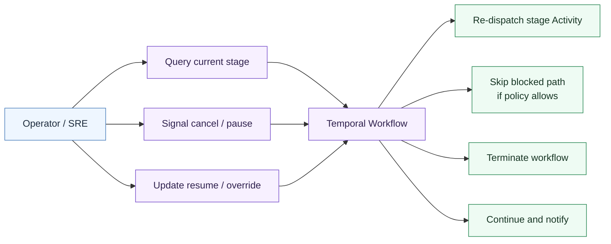

# Operator Controls

```mermaid
flowchart LR
    classDef op fill:#eef6ff,stroke:#4f81bd,color:#1f2d3d,stroke-width:1px;
    classDef wf fill:#f7f0ff,stroke:#7a52cc,color:#2f214d,stroke-width:1px;
    classDef act fill:#eefbf3,stroke:#2d8a57,color:#173524,stroke-width:1px;

    O1[Operator / SRE]:::op --> Q1[Query current stage]:::wf
    O1 --> S1[Signal cancel / pause]:::wf
    O1 --> U1[Update resume / override]:::wf

    Q1 --> WF[Temporal Workflow]:::wf
    S1 --> WF
    U1 --> WF

    WF --> A1[Re-dispatch stage Activity]:::act
    WF --> A2[Skip blocked path\nif policy allows]:::act
    WF --> A3[Terminate workflow]:::act
    WF --> A4[Continue and notify]:::act
```
