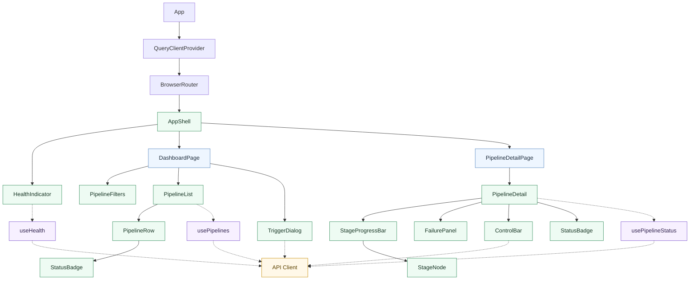
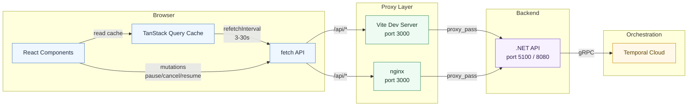

# Dashboard Frontend Architecture

## Component hierarchy

```mermaid
flowchart TD
    classDef page fill:#eef6ff,stroke:#4f81bd,color:#1f2d3d,stroke-width:1px;
    classDef comp fill:#eefbf3,stroke:#2d8a57,color:#173524,stroke-width:1px;
    classDef hook fill:#f7f0ff,stroke:#7a52cc,color:#2f214d,stroke-width:1px;
    classDef api fill:#fff8e8,stroke:#c48a00,color:#5d4300,stroke-width:1px;

    App --> QCP[QueryClientProvider]
    QCP --> Router[BrowserRouter]
    Router --> Shell[AppShell]:::comp

    Shell --> HI[HealthIndicator]:::comp
    Shell --> DP[DashboardPage]:::page
    Shell --> PDP[PipelineDetailPage]:::page

    DP --> PF[PipelineFilters]:::comp
    DP --> PL[PipelineList]:::comp
    DP --> TD[TriggerDialog]:::comp
    PL --> PR[PipelineRow]:::comp
    PR --> SB1[StatusBadge]:::comp

    PDP --> PD[PipelineDetail]:::comp
    PD --> SPB[StageProgressBar]:::comp
    PD --> FP[FailurePanel]:::comp
    PD --> CB[ControlBar]:::comp
    SPB --> SN[StageNode]:::comp
    PD --> SB2[StatusBadge]:::comp

    HI -.-> UH[useHealth]:::hook
    PL -.-> UP[usePipelines]:::hook
    PD -.-> UPS[usePipelineStatus]:::hook

    UP -.-> API[API Client]:::api
    UPS -.-> API
    UH -.-> API
    CB -.-> API
    TD -.-> API
```

## Data flow

```mermaid
flowchart LR
    classDef browser fill:#eef6ff,stroke:#4f81bd,color:#1f2d3d,stroke-width:1px;
    classDef proxy fill:#eefbf3,stroke:#2d8a57,color:#173524,stroke-width:1px;
    classDef backend fill:#f7f0ff,stroke:#7a52cc,color:#2f214d,stroke-width:1px;
    classDef temporal fill:#fff8e8,stroke:#c48a00,color:#5d4300,stroke-width:1px;

    subgraph Browser
        RC[React Components]:::browser
        TQ[TanStack Query Cache]:::browser
        FETCH[fetch API]:::browser
    end

    subgraph Proxy["Proxy Layer"]
        VITE["Vite Dev Server\nport 3000"]:::proxy
        NGINX["nginx\nport 3000"]:::proxy
    end

    subgraph Backend
        API[".NET API\nport 5100 / 8080"]:::backend
    end

    subgraph Orchestration
        TEMP[Temporal Cloud]:::temporal
    end

    RC -->|"read cache"| TQ
    TQ -->|"refetchInterval\n3-30s"| FETCH
    FETCH -->|"/api/*"| VITE
    FETCH -->|"/api/*"| NGINX
    VITE -->|"proxy_pass"| API
    NGINX -->|"proxy_pass"| API
    API -->|"gRPC"| TEMP

    RC -->|"mutations\npause/cancel/resume"| FETCH
```
