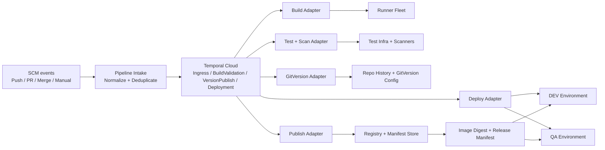
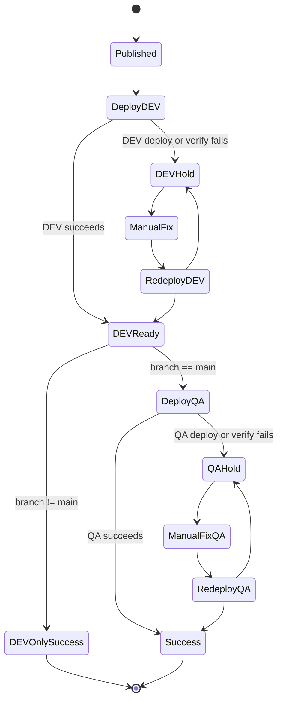

# Temporal Cloud CI/CD Reference Design - Failure Amplification and Recovery Edition

## Summary

This design keeps **Temporal Cloud** as the durable orchestration layer for a vendor-neutral CI/CD system, while external runners perform build, test, publish, and deploy work. The update in this edition is deliberate: every pipeline stage is now described not only by what it does, but by **how failure can spread** and **how the design contains or recovers from it**.

Core rule set:

- build and test first
- run **GitVersion** only after required gates pass
- publish once and deploy the same image digest forward
- deploy to **DEV** for every successful publish
- deploy to **QA only for `main`**, and only after DEV succeeds
- isolate failures early so they do not fan out into multiple environments, duplicate publishes, or invalid versions

## Design goals

- Keep the execution layer vendor neutral
- Use Temporal Workflows for sequencing, retries, timeout handling, and recovery control
- Reduce blast radius when external systems are flaky
- Prevent duplicate side effects during retries
- Make failed workflows resumable, diagnosable, and safe to rerun

## Failure-aware architecture

### Containment boundaries

- **Temporal Cloud** is the control plane and keeps durable pipeline state
- **Task Queues** isolate build, test, version, publish, and deploy work so one worker class does not amplify another class of failure
- **Publish** is the boundary after which deployments consume a fixed digest rather than rebuilding
- **DEV** is the first environment gate and protects QA from unstable builds

## Exact step ordering

1. Receive SCM or manual trigger
2. Normalize metadata and deduplicate the event
3. Start pipeline Workflow
4. Checkout source using repo settings compatible with GitVersion
5. Build/package
6. Run required tests and scans
7. If any required gate fails, stop immediately
8. Run **GitVersion**
9. Resolve version metadata and tag set
10. Publish container image
11. Capture immutable image digest
12. Write release manifest
13. Deploy digest to **DEV**
14. Verify DEV deployment
15. If DEV fails, stop and hold for rerun or remediation
16. If branch is non-`main`, stop successfully after DEV
17. If branch is `main`, deploy the **same digest** to QA
18. Verify QA deployment
19. Mark success or failed hold state

## Failure amplification map

| Failure source | How it can amplify | Control | Recovery |
|---|---|---|---|
| Duplicate SCM events | duplicate workflows, duplicate publishes, repeated deployments | idempotency keys and workflow ID deduplication | resume existing execution instead of starting a new one |
| Flaky build/test runners | repeated long-running work, noisy false failures | separate build/test Task Queues, bounded retries, short Activity timeouts | rerun failed stage only |
| Bad repo checkout for GitVersion | wrong version, wrong tags, publish confusion | require full history or approved shallow mode, explicit branch/ref context | fail before publish and fix checkout configuration |
| Partial publish | image tag exists without manifest, or manifest without final digest | publish and manifest steps tracked separately with idempotent writes | replay publish/manifest stage safely |
| DEV deploy failure | broken build reaches higher environments | QA blocked unless DEV succeeds | hold in DEV-failed state and rerun after fix |
| QA deploy failure | unstable release candidate appears partially progressed | no downstream continuation after QA fail | keep artifact and evidence, retry deploy or promote fixed successor |
| Workflow code change | non-determinism in orchestration path | replay tests before worker rollout | verify with history replay before shifting traffic |

## Recovery model

## Key recovery controls

- **Idempotent Activities** for publish and deploy steps
- **Checkpointing** of long-running Activities where useful
- **Short retries first, manual hold later** for side-effecting failures
- **Release manifest** as the contract for reruns and promotions
- **Digest-based deploys** to avoid rebuild drift during recovery
- **Replay testing** before rolling out Workflow code changes
- **Service Accounts with API keys** for clean automation boundaries

## Branch policy with recovery behavior

### `main`
- build
- test
- GitVersion
- publish
- deploy DEV
- if DEV succeeds, deploy QA
- if QA fails, stop in QA hold state; do not continue

### non-`main`
- build
- test
- GitVersion
- publish
- deploy DEV only
- if DEV fails, stop in DEV hold state

## Component responsibilities

- **Pipeline intake**: normalize, classify, deduplicate
- **Temporal workflows**: sequencing, retries, hold states, recovery branching
- **Adapters**: convert generic workflow intents into runner/registry/deploy calls
- **External systems**: perform execution
- **Manifest store**: preserve version, digest, evidence, and rerun context

## References

- Temporal Activities: https://docs.temporal.io/activities
- Temporal safe deployments and replay testing: https://docs.temporal.io/develop/safe-deployments
- Temporal Cloud service accounts: https://docs.temporal.io/cloud/service-accounts
- GitVersion requirements: https://gitversion.net/docs/reference/requirements
- GitVersion configuration: https://gitversion.net/docs/reference/configuration
